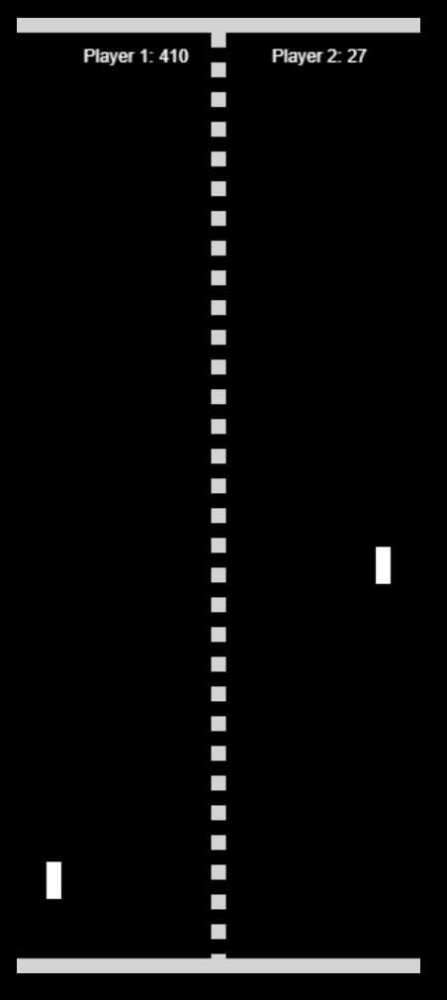

### PROOF OF CONCEPT SODA PONG FACADE PROJECT 👋
Project for projectable html canvases using Symptholight to allow for playing videos games 
via the MMU Soda displays

## Soda Pong frontend
html / css / javascript

## Backend
Node / socket.io / express

### Play Links

- [Main Menu](client/index.html)

### Local testing
npm install 
npm start

## Spec
- index.html - Main Menu
- Screens - Screens with setup
- score.html - screen ?

### screens (Client Side)
- screen A - Prev game score (CSS / HTML / JS)
- screen B - Title (CSS / HTML)
- Screen C - Live score (HTML / CSS / JS)
- Screen D - Queue (HTML / CSS / JS)
- Screen E - MainGame (HTML / CSS / JS)

###  Issue log
- speed bug 
- socket.io - TO TEST 